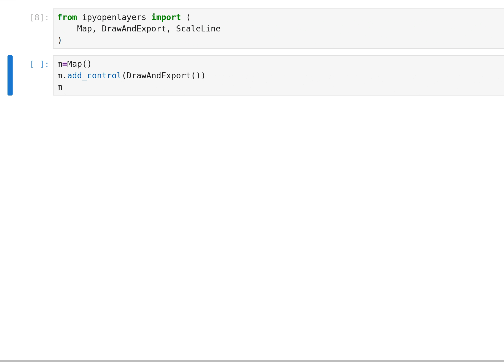

## :wave: Hi, I'm Matt! Website: [`mattz.cool`](https://mattz.cool) {.smaller .even-smaller-header}

:::::::::columns
::::::{.column width=50%}
:::evenly-spaced
:computer: Research Software Engineer ([RSE](https://us-rse.org/))

:people_holding_hands: Community builder

:open_hands: Open source maintainer & contributor:
[jupytergis](https://github.com/geojupyter/jupytergis),
[jupyter-tiler](https://github.com/geojupyter/jupyter-tiler),
[earthaccess](https://github.com/nsidc/earthaccess),
several [conda-forge](https://conda-forge.org/) packages,
more!

:bear: At [Schmidt DSE, UC Berkeley](https://dse.berkeley.edu/)

:snowflake: Previously at [National Snow & Ice Data Center (NSIDC)](https://nsidc.org)

:open_hands: :open_book: :brain:
:seedling: :notes: :drum: :musical_keyboard: :dog:
:::
::::::

::::::{.column width=50%}
](/assets/images/qr.svg){width=100%}
::::::
:::::::::


:::notes
Emojis: Open source, documentation, optimizing for cognitive load, plants and nature,
musical instruments, dogs!
:::


## :wave: Hi, I'm Guillaume! GitHub: [guillaumeeb](https://github.com/guillaumeeb) {.smaller .even-smaller-header}

:::::::::columns
::::::{.column width=50%}
:::evenly-spaced
:computer: :space_invader: Satellite image processing and distributed data analysis expert at [CNES](https://cnes.fr/en)

:snowflake: :floppy_disk: Maintaining snow detection algorithm ([Let it snow](https://gitlab.orfeo-toolbox.org/remote_modules/let-it-snow)), and improving CNES [library ecosystem](https://geodes-tools.cnes.fr/en/) (from the outside mainly)

:earth_asia: Member of [Pangeo community](https://pangeo.io/) for 8 years (missed the start)

:factory: Previously head of the CNES computing center team, specialized in Big Data tools (Spark, Dask)

:open_hands: Open source supporter, funding and small contributor:
[dask](https://github.com/dask/dask),
[dask-jobqueue](https://github.com/dask/dask-jobqueue),
[Let it snow](https://gitlab.orfeo-toolbox.org/remote_modules/let-it-snow),

:open_hands: :satellite: :brain: :earth_asia:
:tent: :runner: :snowboarder: :guitar: :wine_glass: :bridge_at_night:
:::
::::::

::::::{.column width=50%}
](/assets/images/qr.svg){width=100%}
::::::
:::::::::


:::notes
Emojis: Open source, Satellite, optimizing for cognitive load, earth observation,
hiking, running, mountain snow climbing, guitar, party!
:::


# :earth_asia: GeoJupyter community overview

:::{style="font-size: 1.8em"}
:zap: Lightning version!
:::

:link: [geojupyter.org](https://geojupyter.org/)

:::notes
I'm gonna keep this really high level, but feel free to ask me questions or see bonus
slides at the end on your own time :)
:::


## GeoJupyter community overview {.smaller}

:::::::::columns

::::::{.column width="48%"}
:::elevator-pitch
<br />
<br />

<hr />
GeoJupyter is an open and community-owned effort to
[reimagine geospatial interactive computing experiences _within the Jupyter architecture_]{.jupyter-orange}
to enable more people to confidently engage with geospatial data.
<hr />

<br />
<br />

Many players!!!
:::
::::::

::::::{.column width="4%"}
::::::

::::::{.column width="48%"}

::::::

:::::::::

## GeoJupyter community overview {.smaller}

### Open, participatory development

:::evenly-spaced
:revolving_hearts: User-centered & user-led

:hugs: Welcoming (like Jupyter)

:flashlight: Exploring: finding & opening hidden doors

:japanese_castle: Data & computational sovereignty

<br />
<br />
:::


# :building_construction: Projects in the GeoJupyter community


## JupyterGIS


:::notes
...

The development of JupyterGIS has been led by QuantStack.
:::


## :handshake: Collaborate

)](/assets/images/jupytergis-collab-cursors.gif){width=100%}

:::notes
Thanks again to the modular Jupyter architecture, we can leverage
the `jupyter-collaboration` extension, which enables real-time collaboration on
Notebooks, to enable real-time collaboration on a map.

Here you can see two users' cursors (emphasized for visibility) on the same map.
:::


## :handshake: Collaborate: Follow a user

)](/assets/images/jupytergis-collab-follow.gif){width=100%}

:::notes
In this graphic, one user is following another user's viewport activity in real time.
:::


## :handshake: Collaborate: Edit together

)](/assets/images/jupytergis-collab-edit.gif){width=100%}

:::notes
Here you can see collaborators editing a shared map.
:::


## :handshake: Collaborate: Annotations

)](/assets/images/jupytergis-collab-annotate.gif){width=100%}

:::notes
Here you can see collaborators having a spatially aware conversation, like
comments in Google Docs.
:::


## :crystal_ball: Discover data with STAC (WIP)

)](https://eo4society.esa.int/wp-content/uploads/2025/10/screenshot-5.png)

:::notes
We can discover data using Spatio Temporal Asset Catalogs, or "STAC catalogs",
a modern standard for computer interface with data catalogs.

This is a work in progress that will continue to evolve over time!
:::


## :open_book: Tell a story


:::notes
JupyterGIS also has a story builder interface for building map-driven stories.
:::


## Experiment: reproducible viz -> Notebook workflows




## Jupyter Trail (prototyping!)

The [2026 Carto State of Spatial Analytics report](https://go.carto.com/report-state-of-spatial-analytics-2026-carto):

> ...the majority use between 3 and 8 tools to get work done

page 35

. . .

> **Cloud-native** has become non-negotiable

page 23 (emphasis added)

:::notes
...

When working across 3 to 8 tools, it's very difficult to remember or track what you did, and in what order.

Our ability to share, teach about, and reproduce our work all suffer.

...

And because we're at CNG, I wanted to highlight this other claim from the report :)
:::


## Jupyter Trail (prototyping!)

A tool for tracking workflows across tools


:::notes
This diagram shows a hypothetical "trail" through multiple tools.

Here the user has recorded their actions across several tools and curated this history.

Highlight the meaningful part of their path (green line)

De-emphasize their side-quests (faded)

They might use this tool to help them reproduce and/or document their workflow for a
publication.
:::


## Jupyter Tiler

A building block (on top of [TiTiler](https://github.com/developmentseed/titiler/) and
[xpublish-tiles](https://github.com/earth-mover/xpublish-tiles)) for interactively
exploring Xarray data.

:tada: [Available to try now in JupyterGIS](https://jupytergis.readthedocs.io/en/latest/user_guide/python_api/api.html#jupytergis.GISDocument.add_data_array_layer)!


:::notes
Mention Development Seed and Earthmover
:::


## Jupyter Tiler


:::notes
Here, we're directly rendering from an Xarray dataset based on the requested spatial
extent.

This means we can use lazy computation to compute subsets of the dataset to generate
tiles.
We'll show more about this in the demo.
:::


## Jupyter Tiler

::::::evenly-spaced
Google Earth Engine UX with open source tools?

:::fragment
Secret sauce is [using **overviews** efficiently](https://developers.google.com/earth-engine/guides/scale)
:::
::::::

:::notes
Many researchers use GEE because of its strong and _accessible_ visualization-analysis feedback loop.

GEE is expensive and subjects users to vendor lock-in.

We haven't quite nailed this in the open source ecosystem yet.

**The cloud-native pieces are there, but the user experience isn't there yet**.

...

GEE achieves this through efficient use of overviews -- depending on the requested
output scale, the appropriate resolution of input data is used.

In other words, if the map is zoomed all the way out, computation is performed on the
lowest resolution overview.
:::


# :tada: Demo time


## Jupyter Tiler - current limitations

### Overviews


::: footer
Image source: <https://www.kitware.com/deciphering-cloud-optimized-geotiffs/>
:::

:::notes
Let's talk about overviews.

Cloud optimization can mean lots of stuff, and one of those stuff is overviews, or
tile pyramids.

* Lower resolution chunks that can be accessed directly
* Critical for cloud-optimizing our data for visualization!
  When you're zoomed out, it's wasteful to read every pixel on your dataset, because
  your screen probably has far fewer pixels than the full resolution data.
* Zarrs, Cloud Optimized GeoTIFFs are notable formats that support overviews
:::


## Jupyter Tiler - current limitations {.smaller}

### Overviews

:::evenly-spaced
**Problem**: A _computation_ on an Xarray dataset is still performed at full resolution.

For a tight viz-analysis feedback loop, we might want to compute on overviews.
:::

:::notes
For responsive visualization, it's really important to not compute pixels we're not
capable of displaying on-screen.
:::


## Jupyter Tiler - current limitations {.smaller}

### Overviews

An open Xarray `Dataset` represents a single resolution -- no built-in concept of
overviews

:::fragment
A `DataTree` can represent overviews!
But the familiar way of doing computations is with a `Dataset` or `DataArray`.
:::

:::fragment
Can technically map a computation across a `DataTree`!

```python
dt = xr.open_datatree("s3://.../some.zarr", ...)

def add_ndvi(ds):
    ...
    ds["ndvi"] = (ds.nir - ds.red) / (ds.nir + ds.red)
    return ds

dt = dt.map_over_datasets(add_ndvi)
```

[xpublish-tiles](https://github.com/earth-mover/xpublish-tiles) can do something like
this (if handed the appropriate `DataTree` object)
:::

:::notes
* `Dataset` is single-resolution. You can request a specific overview level at open
  time only.
* You could build a GeoZarr-style multiscale DataTree for a single object that knows
  about the overviews.
  xpublish-tiles can do this!
* To do a computation, you can map a function to add an NDVI task graph to each dataset
  in the tree.
  xpublish-tiles can do this but you need to hand it a multiscale `DataTree` object.
:::


## Jupyter Tiler - current limitations

### Overviews

::::::evenly-spaced
:face_with_peeking_eye: That was unfamiliar.
A user wouldn't know they need to do this.

:::fragment
:sparkles: Imagine: Familiar Xarray `Dataset`s (or similar objects) that are aware of overviews
and capable of _computing_ on overviews if explicitly requested (e.g. by a tile server!)
:::

:::fragment
:shrug: How?
:::
::::::

:::notes
* This new complexity and cognitive load is unnecessary friction for something a
  researcher would expect to "just work" -- if my data has overviews, why can't I
  visualize with my overviews?
* Imagine if the existing `Dataset` API had awareness of the presence of overviews and
  would allow extremely granular computations. E.g. "compute NDVI for a small coordinate
  bounding box at max resolution" or "compute NDVI for the whole dataset using the
  coarsest overview".
* How do we build this? Is this a bad idea? Is this feasible? How can we fund the work?
  Does this fit in Xarray or is it a new thing?
  We're looking to y'all for feedback on this idea.
  Find me and let's chat or please reach out post-conference :)
  If you saw Joe Hamman's lightning talk about Zax yesterday, that might be one pathway.
:::


## JupyterGIS with OpenEO (WIP)

Another approach: server-side execution!


## How you can participate in GeoJupyter




# :heart: Thank you! :heart:


# :tada: Bonus slides


## GeoJupyter community overview {.smaller}

## Our values

:::evenly-spaced
:open_hands: **Open source & open science** - geospatial data is important to everyone!

:cartwheeling: **Approachability** and **playfulness**, like desktop GIS tools

:feather: **Flexibility** and **reproducibility**, like coding methods

:performing_arts: **Collaboration** and **storytelling**, like Jupyter Notebooks
:::


## GeoJupyter community overview {.smaller}

### Geospatial data practice for the modern era

**Geospatial data is everywhere and matters for everyone! 🚚🚢🗺️🧪🌏**

:::evenly-spaced
:handshake: Real-time collaboration (like Google Docs)

:recycle: Reproducibility (by default!)

:leaves: Accessibility (transition to new ways of working, including reproducibility)

:cloud: **Cloud-native** (computing, data formats)

:robot: AI :scream: :boom: (risks & opportunities)

<br />
<br />
:::


## GeoJupyter community overview {.smaller}

### Partners :scientist: :teacher: :technologist:

* QuantStack - Open source for science
* Maryam Hosseini - urban systems, computer vision, & open source
* Clancy Wilmott - Critical Cartography, Geovisualisation and Design
* Qiusheng Wu - Geospatial, AI, & education
* Sarah Chasins & Parker Zeigler - cartography, CS, & open source
* Nancy Thomas & Iryna Dronova - Berkeley Geospatial Innovation Facility
* Carl Boettiger - Geospatial, AI, & education
* Benny Szeghy & Esha Potharaju - GeoJupyter interns
* Friends & neighbors: BIDS, MyST, JupyterHub, earthaccess, DevSeed, Pangeo, 2i2c, Clark
  University, Stanford, Simula, CNES, ESA
* **MANY MORE!!!**


## [Potential future initiatives](https://github.com/geojupyter/initiatives/issues?q=sort%3Aupdated-desc%20is%3Aissue%20is%3Aopen%20label%3A%22type%3A%20initiative%22)?

:::evenly-spaced
:open_book: "Scrollytelling" with a Markdown authoring workflow?
([initiative](https://github.com/geojupyter/initiatives/issues/19))

:robot: GeoAI? :thinking:
([initiative](https://github.com/geojupyter/initiatives/issues/14), [prototype](https://github.com/geojupyter/jupyter-geoagent),
[talk](https://www.youtube.com/watch?v=_5yuXU5salY))

:rock: Richer geospatial primitives for Python?
([initiative](https://github.com/geojupyter/initiatives/issues/18))

:mountain: Reproducible GUI "geoprocessing" (following lessons learned from interns' exploration)? ([initiative](https://github.com/geojupyter/initiatives/issues/3))

:art: Reusable symbology editor component?
([initiative](https://github.com/geojupyter/initiatives/issues/8))

:teacher: Example datasets for education?
([initiative](https://github.com/geojupyter/initiatives/issues/9))
:::
